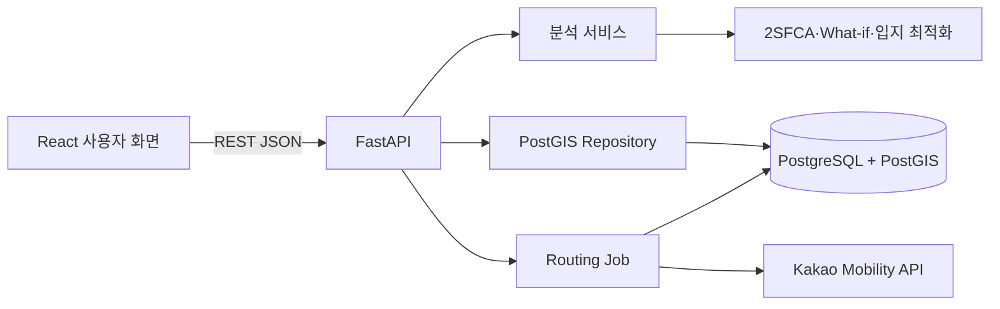

# 전국 의료 인프라 취약지역 분석 및 정책 배치 최적화 서비스

이 문서는 프로젝트를 포트폴리오와 면접에서 설명하기 위한 기준 문서입니다.

- **현재 구현**: 실제 코드와 데이터로 동작하거나 테스트가 완료된 내용
- **진행 중**: 코드 일부는 있지만 전국 실데이터 또는 UI 연결이 완료되지 않은 내용
- **목표 구현**: 최종 서비스 아키텍처에 포함할 예정이지만 아직 구현하지 않은 내용

상세 진행률은 `PROJECT_STATUS.md`를 기준으로 합니다.

## 30초 소개

인구 감소와 고령화가 진행되는 지역은 병원 수만으로 의료 접근성을 판단하기 어렵습니다.
이 프로젝트는 주민등록인구, HIRA 의료기관, SGIS 행정경계와 행정동 인구, Kakao 자동차
이동시간을 전국 229개 시·군·자치구 기준으로 정합합니다. 이를 이용해 30분 의료 접근
가능 인구와 2SFCA 접근성을 계산하고, 한정된 예산으로 신규 의료시설 K개를 어디에
배치해야 고령인구의 접근시간이 가장 많이 개선되는지 추천하는 정책 의사결정 서비스를
목표로 합니다.

## 현재와 목표 범위

| 구분 | 상태 |
|---|---|
| 전국 데이터 ETL·취약도·지도·폐업 What-if | 현재 구현 |
| 실제 폐업 237건 방향성 검증 | 현재 구현 |
| 인구 예측과 강한 기준선 비교 | 현재 구현 |
| Kakao 전국 이동시간 | 진행 중 |
| 30분 접근 가능 인구·2SFCA | 계산 엔진 구현, 전국 통합 진행 중 |
| K개 신규 시설 입지 최적화 | 계산 엔진 구현, 실제 후보 행렬·UI 미완료 |
| FastAPI·PostGIS·React 서비스 | 목표 구현 |
| 추가 정책 What-if·미래 취약도·SHAP | 목표 구현 |

# 1. 프로젝트 기획

## 1.1 문제 정의

기존 의료 현황 통계는 시·군·구별 병원 수나 인구당 기관 수를 주로 보여줍니다. 하지만
같은 병원 수를 가진 지역도 다음 이유로 실제 의료 접근성이 다를 수 있습니다.

- 행정구역이 넓어 병원까지 자동차 이동시간이 긴 경우
- 고령인구가 많아 의료 수요가 큰 경우
- 한 병원을 여러 지역 인구가 함께 이용해 공급 경쟁이 발생하는 경우
- 핵심 병원 한 곳의 폐업이 주변 접근성에 큰 영향을 주는 경우

따라서 이 프로젝트는 단순한 데이터 조회가 아니라 다음 질문에 답하도록 기획했습니다.

> 한정된 예산으로 의료 접근성이 가장 많이 개선되는 지역은 어디인가?

## 1.2 주요 사용자

- 지방자치단체 의료정책 담당자
- 공공의료 시설 배치 검토자
- 지역 의료 접근성 연구자와 데이터 분석가

## 1.3 서비스 입력과 출력

사용자는 지역, 대상 인구, 접근시간 기준, 신규 시설 수 K를 입력합니다.

```text
지역: 전국 또는 특정 시·도
대상: 전체 인구 / 65세 이상 인구
접근 기준: 30분 또는 60분
신규 시설 수: K=1~10
```

서비스는 다음 결과를 제공합니다.

- 현재 평균 자동차 접근시간
- 30분 이내 접근 가능 인구와 초과 인구
- 병상과 수요 경쟁을 반영한 2SFCA 점수
- 추천 신규 시설 위치 K개
- 설치 전후 평균시간과 영향 인구 변화
- 최적화·인구순·무작위 배치 결과 비교

## 1.4 개선 효과

기존의 “병원이 몇 개 있는가”를 “누가 몇 분 안에 실제로 접근할 수 있는가”로 바꾸고,
취약지역 탐색에서 끝나지 않고 예산 배치 대안까지 제시하는 것이 핵심 개선점입니다.

# 2. 데이터 수집

| 데이터 | 기간·기준 | 주요 사용 항목 | 상태 |
|---|---|---|---|
| 행정안전부 주민등록 인구통계 | 2014~2025년 연말 | 총인구, 65세 이상, 19~34세 | 수집 완료 |
| HIRA 전국 병의원·약국 현황 | 2025년 12월 중심 | 기관 ID, 종별, 주소, 좌표, 병상 | 수집 완료 |
| HIRA 연도별 스냅샷 | 2023~2025년 | 실제 폐업 교차검증 | 수집 완료 |
| HIRA 요양기관 폐업 현황 | 2025년 말 누적 | 폐업일, 기관명, 종별, 지역 | 수집 완료 |
| SGIS 행정경계·통계 | 2025년 경계, 2024년 통계 | 시군구 경계, 행정동 인구·중심점 | 수집 완료 |
| Kakao Mobility 길찾기 | 수집 시점 현재 교통망 | 자동차 이동거리·예상시간 | 수집 중 |

현재 정합 결과는 전국 229개 지역, 인구 이력 2,748행, 행정동 수요 지점 3,559개,
HIRA 기관 79,425개입니다. 이 중 병원·종합병원·요양병원·정신병원·보건의료원 등
병원급 기관 3,405개를 공급과 접근성 분석 대상으로 사용합니다.

# 3. 데이터 분석과 전처리

## 3.1 주요 이슈와 해결 방법

### 파일 인코딩과 형식 차이

공공데이터 CSV는 `CP949`, `UTF-8-SIG`가 섞여 있고 HIRA는 ZIP 내부 파일 구조도
시점별로 달랐습니다. 입력 인코딩과 열 이름 후보를 탐색하고, 처리 결과는 UTF-8 CSV로
통일했습니다.

### 행정구역 코드와 명칭 변경

주민등록인구, HIRA, SGIS는 서로 다른 코드와 명칭 체계를 사용합니다.

- 행정코드 앞 5자리로 현재 시군구 코드 생성
- 도의 일반시는 하위 구를 시 단위로 합산
- 군위군 편입, 미추홀구 개명 등 과거 명칭을 현재 코드로 연결
- `시·도 + 정규화된 시군구명`을 우선 사용하고 중복 명칭을 방지

최종적으로 모든 자료를 현재 기준 전국 229개 지역으로 통일했습니다.

### 분석 단위 차이

인구 이력은 시군구, 의료기관은 개별 좌표, SGIS 수요는 행정동 단위입니다. 지역 비교는
시군구 단위로 수행하고, 접근성 계산은 행정동 중심점 3,559개에서 수행한 뒤 인구로
가중 집계합니다.

### SGIS 비밀보호 결측과 기준 인구 차이

SGIS 일부 통계값은 비밀보호로 누락됩니다. 누락값을 0으로 처리한 뒤, 각 시군구의
행정동 인구 합계가 주민등록인구 합계와 일치하도록 비례 재조정했습니다. 따라서 SGIS는
공간 분배 비율로 사용하고 총량 기준은 주민등록인구로 유지합니다.

### 의료기관 분석 대상 정의

약국과 의원까지 모두 포함하면 정책 질문과 공급 단위가 달라지므로, 병상과 입원 기능이
있는 병원급 기관만 접근성과 폐업 시뮬레이션 대상으로 분리했습니다. 원본 전체 기관은
보존하고 `closure_candidate`로 분석 대상을 구분합니다.

### 실제 폐업 매칭

연도별 스냅샷에서 사라진 기관을 바로 폐업으로 간주하지 않고, 누적 폐업 신고자료와
기관명 정규화 키·종별·지역을 함께 사용해 보수적으로 매칭했습니다. 2023→2024년 127건,
2024→2025년 110건으로 총 237건을 매칭했습니다.

### 길찾기 API 쿼터와 중단 복구

행정동 3,559개에서 모든 병원을 직접 요청하면 호출량이 지나치게 큽니다. 먼저
Haversine 직선거리로 가까운 병원 후보를 최대 30곳 선별하고, Kakao 다중 목적지 API로
한 출발지에서 여러 목적지를 한 번에 요청합니다. 결과를 25개 출발지마다 저장하고,
일일 쿼터 도달이나 프로세스 중단 후에도 같은 CSV에서 이어받도록 구현했습니다.

## 3.2 파생 변수

- 5년 인구 증감률
- 고령화율
- 인구 1,000명당 병원급 기관 수
- 행정동 인구가중 최근접 병원 거리·자동차 이동시간
- 30분 이내 접근 가능 인구와 고령인구
- 병상과 생활권 수요 경쟁을 반영한 2SFCA

# 4. 모델 선정, 학습과 평가지표

## 4.1 취약도 점수

현재 취약도는 학습 모델이 아니라 설명 가능한 정책 지표입니다.

| 구성 요소 | 가중치 | 위험 방향 |
|---|---:|---|
| 고령화율 | 25% | 높을수록 위험 |
| 5년 인구변화율 | 20% | 감소가 클수록 위험 |
| 인구당 병원급 기관 | 25% | 적을수록 위험 |
| 인구가중 접근거리 | 30% | 멀수록 위험 |

데이터셋 내부 min-max 대신 고정 경계를 사용해 폐업 전후 점수를 같은 척도로 비교합니다.
가중치와 경계는 MVP 가정이므로 실제 정책 적용 전 전문가 검토와 민감도 분석이
필요합니다.

## 4.2 고령인구 예측 모델

예측 대상은 지역별 65세 이상 인구이며 특성은 지역 코드, 연도, 1년·2년 시차 값,
최근 증감률입니다.

비교 모델:

- 작년 값 유지 기준선
- 최근 1년 증감을 반복하는 선형추세 기준선
- Linear Regression
- Random Forest
- XGBoost

랜덤 분할은 미래 정보 누출 위험이 있으므로 2025년 전체 지역을 시간 홀드아웃으로
사용했습니다. 평가지표는 지역별 예측 오차의 크기를 직접 해석할 수 있는 MAE입니다.

| 모델 | 2025 홀드아웃 MAE |
|---|---:|
| 선형추세 기준선 | **315명** |
| Linear Regression | 340명 |
| Random Forest | 670명 |
| XGBoost | 771명 |
| 작년 값 유지 기준선 | 2,551명 |

Linear Regression은 선형추세 기준선보다 MAE가 7.9% 높았습니다. 따라서 현재 데이터에서
복잡한 ML을 채택하지 않고 선형추세 기준선을 기본 모델로 선택했습니다. “AI를 사용했다”가
아니라 “강한 기준선을 이기지 못한 모델을 배제했다”가 모델 선정의 핵심입니다.

## 4.3 폐업 What-if 검증

예측된 폐업 후 접근거리 변화 방향과 다음 시점 스냅샷에서 관측된 변화 방향을
비교했습니다. ±0.1km를 변화 없음으로 보았을 때 237건의 방향 일치율은 92.4%였습니다.
이는 인과 효과나 일반화된 예측 정확도가 아니라 시뮬레이션 방향성 점검 결과입니다.

## 4.4 2SFCA와 입지 최적화

2SFCA는 각 병원의 `병상 수 ÷ 30분 생활권 고령인구`를 먼저 계산하고, 각 행정동이
30분 안에 접근할 수 있는 병원의 공급비를 다시 합산합니다.

입지 최적화는 후보 시설을 하나씩 추가했을 때 줄어드는 고령인구 가중 이동시간을
계산하고, 매 단계에서 추가 개선량이 가장 큰 후보를 선택하는 greedy 방식입니다.
동일한 K에 대해 인구순 배치와 고정 시드 무작위 배치를 기준선으로 비교합니다.

# 5. 파이썬 백엔드 연동 과정

## 5.1 현재 구현

현재는 Streamlit 프로세스가 Python 분석 모듈을 직접 호출합니다.

```text
사용자 입력
  → Streamlit 위젯
  → simulation.py / forecast.py / accessibility.py / optimization.py
  → pandas DataFrame 결과
  → 지도·지표·표 렌더링
```

예를 들어 병원 폐업 요청은 지역과 병원 ID를 입력받아 병원 제거 전후의 접근거리,
취약도, 영향 인구를 반환합니다. K개 입지 엔진은 현재 접근시간, 후보지 이동시간,
고령인구, K를 입력받아 추천 후보 순서와 전후 지표를 반환합니다.

## 5.2 목표 구현

Python 계산 모듈을 FastAPI 서비스 계층에서 호출하도록 분리합니다.

```text
React 입력 폼
  → JSON 요청
  → FastAPI Pydantic 검증
  → 분석 서비스
  → PostGIS 조회 및 계산
  → JSON 응답
  → React 지도·비교 차트 갱신
```

입지 최적화 요청 예시:

```json
{
  "province_code": "47",
  "facility_count": 3,
  "target_population": "senior_population",
  "threshold_minutes": 30
}
```

목표 응답 예시:

```json
{
  "selected_sites": [
    {
      "rank": 1,
      "candidate_id": "candidate-001",
      "region_name": "영양군",
      "incremental_weighted_minutes_saved": 187420
    }
  ],
  "metrics": {
    "weighted_mean_duration_before": 34.8,
    "weighted_mean_duration_after": 26.1,
    "improved_senior_population": 8420,
    "senior_population_over_30min_before": 15120,
    "senior_population_over_30min_after": 6700
  },
  "comparison": {
    "optimized": 26.1,
    "population_priority": 29.4,
    "random": 31.8
  }
}
```

예시 숫자는 API 계약 설명을 위한 형태이며 실제 분석 결과가 아닙니다.

# 6. 서비스 DB와 테이블 구성

## 6.1 목표 기술

- PostgreSQL
- PostGIS
- Alembic 마이그레이션
- 공간 조회용 GIST 인덱스
- 경로·시점 조회용 복합 B-tree 인덱스

## 6.2 핵심 테이블

### `regions`

| 열 | 설명 |
|---|---|
| `region_code` PK | 현재 기준 시군구 코드 |
| `province_name`, `region_name` | 전체 지역명 |
| `center` Point | 지도 중심점 |
| `geometry` MultiPolygon | 행정경계 |

### `population_history`

| 열 | 설명 |
|---|---|
| `region_code` FK, `year` PK | 지역·연도 복합키 |
| `population` | 총인구 |
| `senior_population` | 65세 이상 인구 |
| `youth_population` | 19~34세 인구 |

### `demand_points`

| 열 | 설명 |
|---|---|
| `demand_id` PK | 행정동 코드 |
| `region_code` FK | 소속 시군구 |
| `name` | 행정동명 |
| `population`, `senior_population` | 재조정된 수요 인구 |
| `location` Point | 행정동 대표 중심점 |

### `facilities`

| 열 | 설명 |
|---|---|
| `facility_id` PK | HIRA 기관 ID |
| `region_code` FK | 소속 지역 |
| `name`, `facility_type` | 기관명과 종별 |
| `beds` | 병상 수 |
| `location` Point | 기관 좌표 |
| `opened_on`, `closed_on` | 개·폐업일 |
| `snapshot_date` | 원본 기준일 |

### `route_matrix`

| 열 | 설명 |
|---|---|
| `demand_id`, `facility_id` PK | 수요지·병원 복합키 |
| `distance_m`, `duration_sec` | 자동차 거리·시간 |
| `status` | 실제·추정·실패 상태 |
| `collected_at` | 수집 시각 |

### `accessibility_scores`

| 열 | 설명 |
|---|---|
| `region_code`, `calculated_at` PK | 지역·산출 버전 |
| `population_within_30min` | 30분 접근 인구 |
| `senior_within_30min` | 30분 접근 고령인구 |
| `two_sfca_score` | 의료 접근성 점수 |

### `candidate_sites`, `candidate_routes`

신규 시설 후보 좌표와 수요 지점별 후보 이동시간을 저장해 K개 최적화를 반복 실행할 때
외부 길찾기 API를 다시 호출하지 않도록 합니다.

### `scenario_runs`, `routing_jobs`

시나리오 입력·결과·실행시간과 카카오 경로 작업의 상태, 진행률, 오류, 재시도 횟수를
저장합니다.

## 6.3 주요 인덱스

- `regions.geometry`, `demand_points.location`, `facilities.location`: GIST
- `route_matrix(demand_id, duration_sec)`
- `route_matrix(facility_id, demand_id)`
- `facilities(region_code, facility_type, snapshot_date)`
- `population_history(region_code, year)`

# 7. 백엔드 REST API

## 7.1 목표 API

| Method | Endpoint | 역할 |
|---|---|---|
| `GET` | `/api/v1/regions` | 지역 목록과 요약 지표 |
| `GET` | `/api/v1/regions/{code}` | 지역 상세 |
| `GET` | `/api/v1/regions/{code}/facilities` | 지도 병원 목록 |
| `GET` | `/api/v1/regions/{code}/accessibility` | 30분 접근성과 2SFCA |
| `POST` | `/api/v1/scenarios/closures` | 병원 폐업 What-if |
| `POST` | `/api/v1/scenarios/bed-reduction` | 병상 감소 What-if |
| `POST` | `/api/v1/optimizations/facilities` | K개 입지 추천 |
| `POST` | `/api/v1/routing/jobs` | 경로 수집 작업 생성 |
| `GET` | `/api/v1/routing/jobs/{job_id}` | 작업 진행률 조회 |

## 7.2 계층 구조

```text
routers      HTTP와 상태 코드
schemas      Pydantic 요청·응답 계약
services     시뮬레이션·2SFCA·최적화 업무 로직
repositories PostGIS 조회와 저장
workers      경로 수집·재시도·지표 재계산
```

분석 알고리즘을 라우터 안에 직접 작성하지 않고 현재 Python 모듈을 서비스 계층에서
재사용합니다. 동일한 입력은 데이터 버전이 같을 때 같은 결과를 반환하도록 하고,
시나리오 결과에는 데이터 기준일과 계산 버전을 포함합니다.

## 7.3 오류와 성능 관리

- 존재하지 않는 지역·병원·후보: `404`
- 잘못된 K·시간 기준: `422`
- 경로 데이터 준비 중: `409`와 현재 진행률
- 오래 걸리는 작업: `202 Accepted`와 `job_id`
- 지역 요약과 2SFCA 결과 캐시
- API 응답시간, 최적화 실행시간, 경로 실패율 기록

# 8. 주요 프론트엔드-백엔드 연동

## 8.1 지역 상세

```text
시·도 선택
  → GET /regions?province_code=47
  → 시군구 목록 갱신
시군구 선택
  → GET /regions/47170
  → GET /regions/47170/facilities
  → GET /regions/47170/accessibility
  → 지도 중심·병원점·2SFCA 카드 갱신
```

병원점을 클릭하면 프론트가 이미 받은 병원명, 종별, 병상, 주소, 개설일을 정보창에
표시하므로 추가 API 호출을 만들지 않습니다.

## 8.2 병원 폐업 What-if

```text
병원 선택
  → POST /scenarios/closures
  → 폐업 전후 접근시간·취약도·영향 인구 수신
  → 지도와 지표를 같은 응답 버전으로 갱신
```

중복 클릭을 막고 요청 중 로딩 상태를 표시하며, 실패 시 기존 결과를 유지하고 오류 이유를
보여줍니다.

## 8.3 K개 신규 시설 최적화

```text
지역·K·대상 인구·시간 기준 입력
  → POST /optimizations/facilities
  → 추천 위치·단계별 개선량·기준선 비교 수신
  → 지도 추천 번호 1~K 표시
  → 설치 전후와 인구순·무작위 비교 차트 갱신
```

계산이 길어질 경우 서버는 `202`와 작업 ID를 반환하고, 프론트는 작업 상태를 주기적으로
조회합니다. 완료 응답을 받으면 지도와 차트를 한 번에 교체합니다.

## 8.4 경로 수집 작업

```text
관리 화면에서 작업 시작
  → POST /routing/jobs
  → job_id 수신
  → GET /routing/jobs/{job_id} 반복 조회
  → 완료 출발지·전체 출발지·실패 건수 표시
```

새로고침해도 서버의 작업 상태를 다시 조회하므로 진행률이 사라지지 않습니다.

# 목표 서비스 구조



# 발표 흐름

1. 병원 수만으로 접근성을 판단하기 어려운 문제 제시
2. 전국 4종 데이터와 분석 단위 설명
3. 행정코드·인코딩·결측·폐업 매칭 문제와 해결 과정
4. 취약도와 2SFCA 정의
5. 시간 홀드아웃과 강한 기준선 비교 결과
6. 폐업 What-if와 실제 폐업 방향성 검증
7. K개 신규 시설 입지 최적화 방식과 기준선 비교
8. FastAPI 요청·응답과 PostGIS 모델
9. React 지도에서 입력부터 결과까지의 연동 흐름
10. 한계, 미완료 범위, 다음 검증 계획

# 면접에서 강조할 핵심

- 서로 다른 행정코드와 공간 단위의 공공데이터를 전국 기준으로 정합했습니다.
- 랜덤 분할 대신 시간 홀드아웃을 사용했고, ML이 단순 기준선보다 나쁘다는 결과를 숨기지
  않았습니다.
- 외부 API 쿼터와 장기 작업 중단을 고려해 캐시와 이어받기를 설계했습니다.
- 분석 결과를 조회하는 데서 끝내지 않고 신규 시설 배치라는 의사결정 문제로 확장했습니다.
- 현재 구현과 목표 아키텍처를 구분하며, 전국 실데이터 검증이 끝난 기능만 완료로
  표시합니다.
