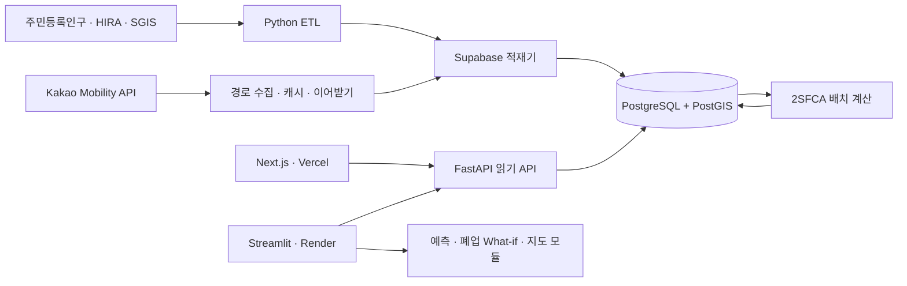

# 메디리치 (MediReach) 포트폴리오 가이드

지역 의료 접근성 분석 및 정책 배치 최적화 서비스

[라이브 대시보드](https://medireach-kr.vercel.app/) ·
[GitHub](https://github.com/shn6029/medireach) ·
[FastAPI 상태](https://regional-medical-risk-api.onrender.com/health) ·
[이력서용 요약](RESUME_PORTFOLIO.md) ·
[구현 현황](PROJECT_STATUS.md)

이 문서는 메디리치를 포트폴리오와 면접에서 설명하기 위한 기준 문서입니다.

- **현재 구현**: 실제 코드와 데이터로 동작하거나 테스트가 완료된 내용
- **진행 중**: 코드 일부는 있지만 전국 실데이터 또는 UI 연결이 완료되지 않은 내용
- **목표 구현**: 최종 서비스 아키텍처에 포함할 예정이지만 아직 구현하지 않은 내용

상세 진행률은 `PROJECT_STATUS.md`를 기준으로 합니다.

## 30초 소개

인구 감소와 고령화가 진행되는 지역은 병원 수만으로 의료 접근성을 판단하기 어렵습니다.
메디리치는 주민등록인구·HIRA 의료기관·SGIS 행정경계와 행정동 인구를 전국 229개
시·군·자치구로 정합하고, Kakao 자동차 경로 106,770개를 구축했습니다. 이를 이용해
30분 의료 접근 가능 인구와 2SFCA 접근성을 계산하고, 병원 폐업 영향과 신규 의료시설
배치 대안을 탐색하는 정책 의사결정 지원 서비스입니다.

## 핵심 수치

| 지표 | 결과 |
|---|---:|
| 분석 지역 | 229개 시·군·자치구 |
| 행정동 수요점 | 3,559개 |
| 분석 대상 병원급 기관 | 3,405개 |
| Kakao 자동차 경로 | 106,770개 |
| 고령인구 30분 커버리지 | 96.43% |
| 실제 폐업 검증 | 237건 |
| 폐업 영향 방향 일치율 | 92.4% |
| 자동화 테스트 | 30개 통과 |

## 현재와 목표 범위

| 구분 | 상태 |
|---|---|
| 전국 데이터 ETL·취약도·지도 | 현재 구현 |
| 실제 폐업 237건 What-if 방향성 검증 | 현재 구현 |
| 인구 예측과 강한 기준선 비교 | 현재 구현 |
| Kakao 자동차 경로 106,770개 | 수집·적재 완료 |
| 30분 접근 가능 인구·2SFCA | 전국 계산·Supabase 저장·FastAPI 조회 완료 |
| Next.js·Vercel 대시보드 | 구현 완료, 2SFCA는 실데이터·그 외 일부 화면은 대표 샘플 |
| Streamlit·FastAPI·PostGIS | 현재 구현 |
| K개 신규 시설 입지 최적화 | 계산 엔진 완료, 실제 후보 행렬·UI 진행 중 |
| 추가 정책 What-if·미래 취약도·SHAP | 미구현 |

# 1. 프로젝트 기획

## 1.1 문제 정의

기존 의료 현황 통계는 시·군·구별 병원 수나 인구당 기관 수를 주로 보여줍니다. 하지만
같은 병원 수를 가진 지역도 다음 이유로 실제 의료 접근성이 다를 수 있습니다.

- 행정구역이 넓어 병원까지 자동차 이동시간이 긴 경우
- 고령인구가 많아 의료 수요가 큰 경우
- 한 병원을 여러 지역 인구가 함께 이용해 공급 경쟁이 발생하는 경우
- 핵심 병원 한 곳의 폐업이 주변 접근성에 큰 영향을 주는 경우

따라서 메디리치는 단순한 데이터 조회가 아니라 다음 질문에 답하도록 기획했습니다.

> 한정된 예산으로 의료 접근성이 가장 많이 개선되는 지역은 어디인가?

## 1.2 주요 사용자

- 지방자치단체 의료정책 담당자
- 공공의료 시설 배치 검토자
- 지역 의료 접근성 연구자와 데이터 분석가

## 1.3 서비스 화면과 데이터 연결

| 화면 | 주요 입력·출력 | 데이터 상태 |
|---|---|---|
| 전국 개요·지도·지역 상세 | 취약도, 병원·수요점, 지역 비교 | 대표 샘플과 실제 전국 집계 혼합 |
| 고령인구 예측 | 기준선·ML 오차 비교, 미래 추이 | Python 분석 완료, 웹은 대표 샘플 |
| 병원 폐업 시뮬레이션 | 지역·병원 선택, 전후 접근성·취약도 | 엔진·실제 폐업 검증 완료, 웹은 대표 샘플 |
| 2SFCA 접근성 | 전국 요약, 지역별 고령자 커버리지 | FastAPI 실데이터 |
| 신규 시설 K개 배치 | 추천 후보와 기준선 비교 | 엔진 완료, 후보 행렬·UI 진행 중 |

웹 화면 하단에는 실데이터와 대표 샘플 여부를 명시합니다. 완료되지 않은 입지 추천 UI를
현재 기능처럼 제시하지 않고, 분석 엔진과 서비스 연결 범위를 구분합니다.

## 1.4 개선 효과

기존의 “병원이 몇 개 있는가”를 “누가 몇 분 안에 실제로 접근할 수 있는가”로 바꾸고,
취약지역 탐색에서 끝나지 않고 예산 배치 대안까지 제시하는 것이 핵심 개선점입니다.

# 2. 데이터 수집

| 데이터 | 기간·기준 | 주요 사용 항목 | 상태 |
|---|---|---|---|
| 행정안전부 주민등록 인구통계 | 2014~2025년 연말 | 총인구, 65세 이상, 19~34세 | 수집 완료 |
| HIRA 전국 병의원·약국 현황 | 2025년 12월 중심 | 기관 ID, 종별, 주소, 좌표, 병상 | 수집 완료 |
| HIRA 연도별 스냅샷 | 2023~2025년 | 실제 폐업 교차검증 | 수집 완료 |
| HIRA 요양기관 폐업 현황 | 2025년 말 누적 | 폐업일, 기관명, 종별, 지역 | 수집 완료 |
| SGIS 행정경계·통계 | 2025년 경계, 2024년 통계 | 시군구 경계, 행정동 인구·중심점 | 수집 완료 |
| Kakao Mobility 길찾기 | 수집 시점 현재 교통망 | 자동차 이동거리·예상시간 | 106,770개 수집 완료 |

현재 정합 결과는 전국 229개 지역, 인구 이력 2,748행, 행정동 수요 지점 3,559개,
HIRA 기관 79,425개입니다. 이 중 병원·종합병원·요양병원·정신병원·보건의료원 등
병원급 기관 3,405개를 공급과 접근성 분석 대상으로 사용합니다.

# 3. 데이터 분석과 전처리

## 3.1 주요 이슈와 해결 방법

### 파일 인코딩과 형식 차이

공공데이터 CSV는 `CP949`, `UTF-8-SIG`가 섞여 있고 HIRA는 ZIP 내부 파일 구조도
시점별로 달랐습니다. 입력 인코딩과 열 이름 후보를 탐색하고, 처리 결과는 UTF-8 CSV로
통일했습니다.

### 행정구역 코드와 명칭 변경

주민등록인구, HIRA, SGIS는 서로 다른 코드와 명칭 체계를 사용합니다.

- 행정코드 앞 5자리로 현재 시군구 코드 생성
- 도의 일반시는 하위 구를 시 단위로 합산
- 군위군 편입, 미추홀구 개명 등 과거 명칭을 현재 코드로 연결
- `시·도 + 정규화된 시군구명`을 우선 사용하고 중복 명칭을 방지

최종적으로 모든 자료를 현재 기준 전국 229개 지역으로 통일했습니다.

### 분석 단위 차이

인구 이력은 시군구, 의료기관은 개별 좌표, SGIS 수요는 행정동 단위입니다. 지역 비교는
시군구 단위로 수행하고, 접근성 계산은 행정동 중심점 3,559개에서 수행한 뒤 인구로
가중 집계합니다.

### SGIS 비밀보호 결측과 기준 인구 차이

SGIS 일부 통계값은 비밀보호로 누락됩니다. 누락값을 0으로 처리한 뒤, 각 시군구의
행정동 인구 합계가 주민등록인구 합계와 일치하도록 비례 재조정했습니다. 따라서 SGIS는
공간 분배 비율로 사용하고 총량 기준은 주민등록인구로 유지합니다.

### 의료기관 분석 대상 정의

약국과 의원까지 모두 포함하면 정책 질문과 공급 단위가 달라지므로, 병상과 입원 기능이
있는 병원급 기관만 접근성과 폐업 시뮬레이션 대상으로 분리했습니다. 원본 전체 기관은
보존하고 `closure_candidate`로 분석 대상을 구분합니다.

### 실제 폐업 매칭

연도별 스냅샷에서 사라진 기관을 바로 폐업으로 간주하지 않고, 누적 폐업 신고자료와
기관명 정규화 키·종별·지역을 함께 사용해 보수적으로 매칭했습니다. 2023→2024년 127건,
2024→2025년 110건으로 총 237건을 매칭했습니다.

### 길찾기 API 쿼터와 중단 복구

행정동 3,559개에서 모든 병원을 직접 요청하면 호출량이 지나치게 큽니다. 먼저
Haversine 직선거리로 가까운 병원 후보를 최대 30곳 선별하고, Kakao 다중 목적지 API로
한 출발지에서 여러 목적지를 한 번에 요청합니다. 결과를 25개 출발지마다 저장하고,
일일 쿼터 도달이나 프로세스 중단 후에도 같은 CSV에서 이어받도록 구현했습니다.

## 3.2 파생 변수

- 5년 인구 증감률
- 고령화율
- 인구 1,000명당 병원급 기관 수
- 행정동 인구가중 최근접 병원 거리·자동차 이동시간
- 30분 이내 접근 가능 인구와 고령인구
- 병상과 생활권 수요 경쟁을 반영한 2SFCA

# 4. 모델 선정, 학습과 평가지표

## 4.1 취약도 점수

현재 취약도는 학습 모델이 아니라 설명 가능한 정책 지표입니다.

| 구성 요소 | 가중치 | 위험 방향 |
|---|---:|---|
| 고령화율 | 25% | 높을수록 위험 |
| 5년 인구변화율 | 20% | 감소가 클수록 위험 |
| 인구당 병원급 기관 | 25% | 적을수록 위험 |
| 인구가중 접근거리 | 30% | 멀수록 위험 |

데이터셋 내부 min-max 대신 고정 경계를 사용해 폐업 전후 점수를 같은 척도로 비교합니다.
가중치와 경계는 MVP 가정이므로 실제 정책 적용 전 전문가 검토와 민감도 분석이
필요합니다.

## 4.2 고령인구 예측 모델

예측 대상은 지역별 65세 이상 인구이며 특성은 지역 코드, 연도, 1년·2년 시차 값,
최근 증감률입니다.

비교 모델:

- 작년 값 유지 기준선
- 최근 1년 증감을 반복하는 선형추세 기준선
- Linear Regression
- Random Forest
- XGBoost

랜덤 분할은 미래 정보 누출 위험이 있으므로 2025년 전체 지역을 시간 홀드아웃으로
사용했습니다. 평가지표는 지역별 예측 오차의 크기를 직접 해석할 수 있는 MAE입니다.

| 모델 | 2025 홀드아웃 MAE |
|---|---:|
| 선형추세 기준선 | **315명** |
| Linear Regression | 340명 |
| Random Forest | 670명 |
| XGBoost | 771명 |
| 작년 값 유지 기준선 | 2,551명 |

Linear Regression은 선형추세 기준선보다 MAE가 7.9% 높았습니다. 따라서 현재 데이터에서
복잡한 ML을 채택하지 않고 선형추세 기준선을 기본 모델로 선택했습니다. “AI를 사용했다”가
아니라 “강한 기준선을 이기지 못한 모델을 배제했다”가 모델 선정의 핵심입니다.

## 4.3 폐업 What-if 검증

예측된 폐업 후 접근거리 변화 방향과 다음 시점 스냅샷에서 관측된 변화 방향을
비교했습니다. ±0.1km를 변화 없음으로 보았을 때 237건의 방향 일치율은 92.4%였습니다.
이는 인과 효과나 일반화된 예측 정확도가 아니라 시뮬레이션 방향성 점검 결과입니다.

## 4.4 2SFCA와 입지 최적화

2SFCA는 각 병원의 `병상 수 ÷ 30분 생활권 고령인구`를 먼저 계산하고, 각 행정동이
30분 안에 접근할 수 있는 병원의 공급비를 다시 합산합니다.

입지 최적화는 후보 시설을 하나씩 추가했을 때 줄어드는 고령인구 가중 이동시간을
계산하고, 매 단계에서 추가 개선량이 가장 큰 후보를 선택하는 greedy 방식입니다.
동일한 K에 대해 인구순 배치와 고정 시드 무작위 배치를 기준선으로 비교합니다.

# 5. 서비스 연동 구조

## 5.1 현재 구현

전국 데이터와 자동차 경로는 배치 파이프라인에서 Supabase PostgreSQL에 적재합니다.
2SFCA 계산 결과는 실행 이력과 함께 저장하고, FastAPI가 최신 완료 실행만 읽어
Next.js와 Streamlit에 제공합니다.

```text
주민등록인구·HIRA·SGIS·Kakao
  → Python ETL·경로 수집
  → Supabase PostgreSQL + PostGIS
  → 2SFCA 배치 계산·결과 저장
  → FastAPI 읽기 API
  → Next.js 2SFCA 화면 / Streamlit 2SFCA 탭
```

Next.js는 서버 프록시를 통해 FastAPI 주소를 숨기고, 로딩·오류·빈 결과 상태를 각각
처리합니다. DB 연결 문자열과 서비스 역할 키는 브라우저에 전달하지 않습니다.

Streamlit의 취약도·예측·폐업 What-if·지도 화면은 Python 분석 모듈을 직접 호출합니다.
K개 입지 엔진도 구현되어 있지만 실제 후보지 이동시간 행렬과 사용자 화면은 아직
연결하지 않았습니다.

## 5.2 실데이터와 대표 샘플 구분

- Next.js `2SFCA 접근성` 화면: FastAPI와 Supabase의 최신 실데이터
- Next.js 전국 개요·지도·지역 상세·예측·폐업 화면: 사용자 흐름을 보여주는 대표 샘플
- Streamlit: 정합 데이터와 Python 계산 모듈 중심의 분석 화면
- 신규 시설 K개 입지: 계산 엔진과 단위 테스트 완료, 실제 후보 행렬·UI 미완료

이 구분은 각 웹 화면 하단과 README에 표시합니다. 포트폴리오에서는 프로토타입 화면을
실데이터 서비스로 과장하지 않고, 계산 엔진·데이터 파이프라인·UI 연결 상태를 분리해
설명합니다.

# 6. 서비스 DB와 테이블 구성

## 6.1 현재 기술

- Supabase PostgreSQL
- PostGIS
- SQL 마이그레이션
- 공간 조회용 GIST 인덱스
- 경로·시점 조회용 복합 B-tree 인덱스

초기 마이그레이션은 실제 원격 Supabase에 적용했으며, 모든 공개 테이블에 RLS를
활성화하고 브라우저 직접 접근 정책은 만들지 않았습니다.

## 6.2 핵심 테이블

### `regions`

| 열 | 설명 |
|---|---|
| `region_code` PK | 현재 기준 시군구 코드 |
| `province_name`, `region_name` | 전체 지역명 |
| `center` Point | 지도 중심점 |
| `geometry` MultiPolygon | 행정경계 |

### `population_history`

| 열 | 설명 |
|---|---|
| `region_code` FK, `year` PK | 지역·연도 복합키 |
| `population` | 총인구 |
| `senior_population` | 65세 이상 인구 |
| `youth_population` | 19~34세 인구 |

### `demand_points`

| 열 | 설명 |
|---|---|
| `demand_id` PK | 행정동 코드 |
| `region_code` FK | 소속 시군구 |
| `name` | 행정동명 |
| `population`, `senior_population` | 재조정된 수요 인구 |
| `location` Point | 행정동 대표 중심점 |

### `facilities`

| 열 | 설명 |
|---|---|
| `facility_id` PK | HIRA 기관 ID |
| `region_code` FK | 소속 지역 |
| `name`, `facility_type` | 기관명과 종별 |
| `beds` | 병상 수 |
| `location` Point | 기관 좌표 |
| `opened_on`, `closed_on` | 개·폐업일 |
| `snapshot_date` | 원본 기준일 |

### `route_matrix`

| 열 | 설명 |
|---|---|
| `demand_id`, `facility_id` PK | 수요지·병원 복합키 |
| `distance_m`, `duration_sec` | 자동차 거리·시간 |
| `status` | 실제·추정·실패 상태 |
| `collected_at` | 수집 시각 |

### `accessibility_runs`, `demand_accessibility_scores`, `regional_accessibility_scores`

| 열 | 설명 |
|---|---|
| `run_id` | 계산 실행과 데이터 버전 |
| `method_version`, `catchment_minutes` | 분석 방법과 임계시간 |
| `accessible_hospital_count`, `accessible_beds` | 수요점별 접근 공급량 |
| `population_within_threshold_pct` | 지역별 전체 인구 커버리지 |
| `senior_within_threshold_pct` | 지역별 고령인구 커버리지 |
| `two_sfca_score` | 수요 경쟁을 반영한 의료 접근성 점수 |

### `candidate_sites`, `candidate_routes`

신규 시설 후보 좌표와 수요 지점별 후보 이동시간을 저장해 K개 최적화를 반복 실행할 때
외부 길찾기 API를 다시 호출하지 않도록 설계했습니다. 테이블과 계산 엔진은 준비됐지만
실제 후보 데이터와 이동시간 행렬은 아직 구축 중입니다.

### `scenario_runs`, `routing_jobs`

시나리오 입력·결과·실행시간과 카카오 경로 작업의 상태, 진행률, 오류, 재시도 횟수를
저장하기 위한 스키마입니다. 현재 경로 수집은 로컬 CSV 캐시와 이어받기 방식으로
완료했으며, 작업 API와 비동기 worker 연결은 후속 범위입니다.

## 6.3 주요 인덱스

- `regions.boundary`, `regions.center`, `demand_points.location`, `facilities.location`: GIST
- `route_matrix(demand_id, route_duration_min)`
- `route_matrix(facility_id, demand_id)`
- `facilities(region_code, facility_type)`
- `facility_snapshots(snapshot_date, region_code)`
- `regional_accessibility_scores(region_code, run_id)`

# 7. 백엔드 REST API

## 7.1 현재 API

| Method | Endpoint | 역할 |
|---|---|---|
| `GET` | `/health` | API 상태 확인 |
| `GET` | `/api/v1/accessibility/latest` | 최신 완료 2SFCA 실행의 전국 요약 |
| `GET` | `/api/v1/accessibility/regions` | 최신 실행의 229개 지역 결과 |
| `GET` | `/api/v1/accessibility/regions/{region_code}` | 지역과 행정동 수요점 상세 |

## 7.2 계층 구조

```text
Next.js API proxy  브라우저 요청과 FastAPI 주소 분리
FastAPI endpoint   HTTP 응답과 404 처리
repository         최신 완료 실행·지역·수요점 조회
psycopg pool       제한된 PostgreSQL 연결 재사용
Supabase           실행 이력과 2SFCA 결과 저장
```

FastAPI는 계산을 요청마다 다시 수행하지 않고, 배치 파이프라인이 저장한 최신
`completed` 실행을 읽습니다. 수요점별 결과와 지역 집계가 같은 `run_id`를 사용하므로
화면에서 데이터 버전을 추적할 수 있습니다.

## 7.3 현재 오류·성능 처리

- 완료된 2SFCA 실행이 없거나 지역이 없으면 `404`
- 연결 풀을 재사용하고 애플리케이션 종료 시 명시적으로 닫음
- DB 연결 문자열은 서버에서만 사용
- Next.js에서 로딩·빈 결과·API 오류와 재시도 UI를 분리

폐업 What-if, K개 입지 추천과 경로 작업 생성 API는 아직 공개 REST API로 구현하지
않았습니다. 현재는 Python 계산 엔진으로 검증하며, 실제 후보 행렬과 작업 관리 방식이
완성된 뒤 서비스 API로 확장할 계획입니다.

# 8. 주요 프론트엔드-백엔드 연동

## 8.1 2SFCA 실데이터 화면

```text
Next.js 2SFCA 화면
  → /api/proxy 경유
  → GET /api/v1/accessibility/latest
  → GET /api/v1/accessibility/regions
  → 전국 커버리지·수요점·경로 수와 지역 순위 렌더링
```

SWR로 두 요청의 로딩과 재시도를 관리합니다. 지역 상세 API는 행정동별 접근 병원 수,
병상 수, 임계시간 충족 여부와 2SFCA 점수를 반환합니다.

## 8.2 대표 샘플 화면

- 전국 개요·지도: 취약도 분포와 지역 탐색 흐름
- 지역 상세: 병원점·행정동 수요점과 세부 카드
- 고령인구 예측: 기준선과 ML 모델의 MAE 및 추이 비교
- 폐업 시뮬레이션: 병원 선택과 폐업 전후 지표·검증 산점도

이 화면들은 분석 방법과 UX를 보여주기 위한 대표 샘플이며, 화면 하단에 그 사실을
표시합니다. Python 엔진과 전국 검증 결과가 존재하더라도 웹의 개별 표시값이 실데이터라고
오해하지 않도록 구분했습니다.

## 8.3 Streamlit 분석 화면

```text
사용자 입력
  → Streamlit 위젯
  → simulation.py / forecast.py / accessibility.py
  → pandas DataFrame
  → 지도·지표·표 렌더링
```

2SFCA 탭은 FastAPI도 조회하며, API 연결 실패 시 원인을 화면에 표시합니다.

## 8.4 경로 수집 배치

```text
Haversine으로 수요점별 가까운 병원 30곳 선별
  → Kakao 다중 목적지 API 호출
  → 25개 출발지마다 CSV 저장
  → 쿼터 도달·중단 시 기존 CSV에서 재개
  → 3,559개 출발지와 106,770개 경로 적재
```

관리 화면과 비동기 작업 API는 아직 구현하지 않았습니다. 현재 배치는 CLI와 CSV 캐시로
재현·복구할 수 있습니다.

# 현재 서비스 구조



# 발표 흐름

1. 메디리치가 해결하려는 “병원 수와 실제 접근성의 차이” 제시
2. 전국 229개 지역·3,559개 수요점·3,405개 병원의 분석 규모 설명
3. 행정코드·공간 단위·SGIS 결측 정합 과정 설명
4. API 쿼터와 중단 복구를 고려한 Kakao 경로 106,770개 구축
5. 30분 커버리지와 수요 경쟁을 반영한 2SFCA 정의
6. 실제 폐업 237건을 이용한 What-if 방향성 검증
7. 시간 홀드아웃에서 ML과 강한 선형추세 기준선 비교
8. Next.js → FastAPI → Supabase 실데이터 화면 시연
9. K개 입지 엔진의 greedy 방식과 아직 남은 후보 행렬·UI 구분
10. 도로 원점 추정 경로, 중심점 가정과 정책 지표의 한계 설명

# 면접에서 강조할 핵심

- 서로 다른 행정코드와 공간 단위의 공공데이터를 전국 기준으로 정합했습니다.
- 랜덤 분할 대신 시간 홀드아웃을 사용했고, ML이 단순 기준선보다 나쁘다는 결과를 숨기지
  않았습니다.
- 외부 API 쿼터와 장기 작업 중단을 고려해 캐시와 이어받기를 설계했습니다.
- 배치 계산 결과를 Supabase에 버전별로 저장하고 FastAPI가 최신 완료 실행만 읽도록
  구성했습니다.
- 분석 결과를 조회하는 데서 끝내지 않고 신규 시설 배치라는 의사결정 문제로 확장했습니다.
- 웹의 실데이터와 대표 샘플, 계산 엔진과 미완료 UI를 명시적으로 구분했습니다.
