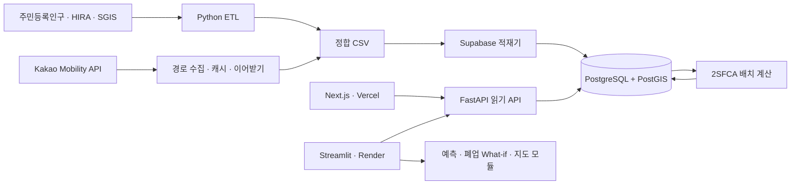

# 메디리치 (MediReach)

> 의료가 닿지 않는 곳을 데이터로 찾다

[](https://www.python.org/)
[](https://fastapi.tiangolo.com/)
[](https://supabase.com/)


[라이브 대시보드](https://medireach-kr.vercel.app/) ·
[FastAPI 상태](https://regional-medical-risk-api.onrender.com/health) ·
[이력서용 프로젝트 소개](RESUME_PORTFOLIO.md) ·
[발표·면접 가이드](PORTFOLIO_GUIDE.md) ·
[구현 현황](PROJECT_STATUS.md)

주민등록인구·HIRA·SGIS 데이터를 전국 **229개 시·군·자치구**와
**3,559개 행정동 수요점**으로 정합하고, **106,770개 자동차 경로**를 구축해
2SFCA 의료 접근성과 병원 폐업 영향을 분석한 개인 프로젝트입니다.

실제 폐업 **237건**으로 What-if 결과의 변화 방향을 검증했고, 인구 예측에서는
복잡한 머신러닝 모델이 강한 선형추세 기준선을 이기지 못한다는 결과도 그대로
공개했습니다.

> 이 저장소에는 Next.js 대시보드, Python 분석 엔진, 데이터 ETL, Streamlit 앱,
> FastAPI와 Supabase/PostGIS migration이 포함됩니다. Vercel 대시보드의
> **2SFCA 접근성** 화면은 FastAPI 실데이터를 조회하며, 그 외 일부
> 지역·예측·시뮬레이션 화면은 현재 대표 샘플로 사용자 흐름을 보여줍니다.
> 실데이터 연결 여부는 각 화면 하단에 표시합니다.

## 프로젝트 개요

인구 감소와 고령화가 진행되는 지역은 병원 수만으로 의료 접근성을 판단하기 어렵습니다.
같은 수의 병원이 있어도 행정구역의 크기, 자동차 이동시간, 고령인구 규모, 병상 공급과
주변 지역의 수요 경쟁에 따라 실제 접근성은 달라집니다.

이 프로젝트는 다음 질문에 답하는 것을 목표로 합니다.

1. 고령인구가 병원급 의료기관에 30분 안에 접근하기 어려운 지역은 어디인가?
2. 특정 병원이 폐업하면 접근거리, 취약도와 영향 인구는 어떻게 달라지는가?
3. 한정된 예산으로 신규 의료시설 K개를 어디에 배치해야 개선 효과가 큰가?

개인 프로젝트로 기획, 공공데이터 정합, 공간 분석, 모델 검증, DB 설계, API와 대시보드
구현 및 배포를 수행했습니다.

## 핵심 결과

| 항목 | 결과 |
|---|---:|
| 분석 지역 | 전국 229개 시·군·자치구 |
| 인구 이력 | 2014~2025년, 2,748행 |
| 행정동 수요 지점 | 3,559개 |
| HIRA 의료기관 원본 | 79,425개 |
| 분석 대상 병원급 기관 | 3,405개 |
| 저장된 Kakao 자동차 경로 | 106,770개 |
| 실제 폐업 검증 사례 | 237건 |
| 폐업 영향 변화 방향 일치율 | 92.4% |
| 최신 2SFCA 고령인구 30분 커버율 | 96.43% |
| 자동화 테스트 | 30개 통과 |

최신 완료 2SFCA 실행은 수요점 3,559개와 지역 229개의 결과를 Supabase에 저장합니다.
전국 커버율이 높더라도 지역별 격차가 크므로 평균만으로 취약지역을 판단하지 않습니다.

## 이 프로젝트에서 해결한 문제

### 1. 서로 다른 공공데이터의 행정구역 정합

주민등록인구, HIRA와 SGIS는 코드·명칭·공간 단위가 서로 다릅니다.

- 행정코드 앞 5자리를 기준으로 현재 시군구 코드를 구성했습니다.
- 도의 일반시는 하위 구를 시 단위로 합산했습니다.
- 군위군 편입, 미추홀구 개명 등 과거 명칭을 현재 코드로 연결했습니다.
- SGIS 행정동 인구는 공간 분포 비율로 사용하고, 시군구 총량은 주민등록인구에 맞게
  재조정했습니다.
- 최종적으로 모든 자료를 현재 기준 전국 229개 지역으로 통일했습니다.

### 2. 외부 길찾기 API의 쿼터와 중단 복구

행정동 3,559개에서 전국 병원으로 경로를 요청하면 호출량이 지나치게 커집니다.

- Haversine 직선거리로 가까운 병원 후보 30곳을 먼저 선별했습니다.
- Kakao 다중 목적지 API로 출발지 하나에서 여러 목적지를 한 번에 조회했습니다.
- 결과를 주기적으로 저장하고 기존 CSV를 기준으로 이어받도록 구현했습니다.
- 일일 출발지 제한을 두어 API 쿼터 안에서 전국 수집을 완료했습니다.

### 3. 강한 기준선과 시간 홀드아웃

미래 정보를 섞는 랜덤 분할 대신 2025년 전체 지역을 시간 홀드아웃으로 사용했습니다.
작년 값 유지와 선형추세를 기준선으로 두고 Linear Regression, Random Forest와 XGBoost를
비교했습니다.

| 모델 | 2025 홀드아웃 MAE |
|---|---:|
| Linear Trend Baseline | **315명** |
| Linear Regression | 340명 |
| Random Forest | 670명 |
| XGBoost | 771명 |
| Naive Baseline (Last Value) | 2,551명 |

Linear Regression도 선형추세 기준선보다 MAE가 7.9% 높았습니다. 따라서 복잡한 모델을
채택하지 않고 선형추세를 기본 예측으로 선택했습니다. 이 결과는 “AI를 사용했다”보다
검증 결과에 따라 모델 복잡도를 낮춘 의사결정을 보여줍니다.

### 4. 실제 폐업 사례를 이용한 방향성 검증

연도별 HIRA 스냅샷에서 사라진 기관을 바로 폐업으로 보지 않고, 누적 폐업 신고자료와
기관명·종별·지역을 함께 사용해 보수적으로 매칭했습니다.

- 2023→2024년: 127건
- 2024→2025년: 110건
- 전체: 237건

예측된 접근거리 변화와 다음 시점에서 관측된 변화의 방향을 비교했습니다. ±0.1km를
변화 없음으로 보았을 때 방향 일치율은 92.4%였습니다. 이는 폐업의 인과 효과나 일반적인
예측 정확도가 아니라 시뮬레이션 방향성을 점검한 결과입니다.

## 주요 기능과 현재 상태

| 기능 | 상태 | 설명 |
|---|---|---|
| 전국 데이터 ETL | 완료 | 인구·의료기관·행정경계·수요점 정합 |
| 전국 취약도·지도 | 완료 | 229개 지역 polygon과 설명 가능한 취약도 |
| 지역 상세 | 완료 | 병원급 기관과 행정동 수요점 지도 |
| 고령인구 예측 | 완료 | 기준선과 ML 모델의 시간 홀드아웃 비교 |
| 병원 폐업 What-if | 완료 | 폐업 전후 공급·접근거리·취약도·영향 인구 비교 |
| Kakao 자동차 경로 | 완료 | 3,559개 출발지 × 가까운 병원 30곳 |
| 30분 커버리지·2SFCA | 완료 | 전국 배치 계산, Supabase 저장, FastAPI 조회 |
| K개 신규 시설 입지 엔진 | 엔진 완료 | greedy 최적화와 인구순·고정 시드 무작위 기준선 |
| 2SFCA 지도 확장 | 진행 중 | 전국 지도와 지역 상세 시각화 |
| 신규 시설 후보 행렬·UI | 진행 중 | 실제 후보 정의, 경로 행렬과 K 선택 화면 |

완료·진행 중·목표 범위의 상세 기준은 [PROJECT_STATUS.md](PROJECT_STATUS.md)를 따릅니다.

## 현재 아키텍처



### 기술 선택

| 영역 | 기술 | 선택 이유 |
|---|---|---|
| 분석·ETL | Python, pandas, GeoPandas | 공공데이터와 공간자료 정합 |
| 예측 | scikit-learn, XGBoost | 동일 데이터 분할에서 기준선과 비교 |
| 웹 UI | Next.js, TypeScript, Tailwind CSS | FastAPI 실데이터와 대표 분석 화면 제공 |
| 분석 UI | Streamlit, Plotly, Kakao Maps | Python 분석 모듈을 직접 탐색 |
| API | FastAPI, Pydantic | 읽기 전용 응답 계약과 자동 API 문서 |
| DB | Supabase PostgreSQL, PostGIS | 공간 타입, 실행 이력과 분석 결과 저장 |
| DB 연결 | psycopg, connection pool | 서버 전용 연결과 제한된 풀 크기 |
| 배포 | Vercel, Render | UI와 Python API·앱을 분리 배포 |
| 테스트 | pytest | ETL, 예측, 시뮬레이션, 접근성, API 검증 |

## 데이터와 분석 기준

| 자료 | 기준 | 분석에 사용한 항목 |
|---|---|---|
| [행정안전부 주민등록 인구통계](https://jumin.mois.go.kr/) | 2014~2025년 연말 | 총인구, 65세 이상, 19~34세 |
| [HIRA 전국 병의원 및 약국 현황](https://www.data.go.kr/data/15051059/fileData.do) | 2025년 12월 중심 | 기관 ID, 종별, 좌표, 병상 |
| HIRA 연도별 스냅샷·폐업 현황 | 2023~2025년 | 실제 폐업 교차검증 |
| [SGIS 행정구역 통계 및 경계](https://www.data.go.kr/data/15129688/fileData.do) | 2025년 경계·2024년 통계 | 경계 polygon, 행정동 인구와 중심점 |
| Kakao Mobility 길찾기 | 수집 시점 현재 도로망 | 자동차 이동거리와 예상시간 |

HIRA 좌표 보유 기관 79,425개 중 병원·종합병원·요양병원·정신병원·보건의료원 등
병원급 기관 3,405개를 공급·접근성·폐업 분석 대상으로 사용했습니다.

## 지표 정의

### 2SFCA 접근성

2SFCA(2-Step Floating Catchment Area)는 병원의 공급량과 주변 인구의 수요 경쟁을
두 단계로 반영합니다.

1. 병원별로 30분 생활권의 고령인구를 합산해 `병상 수 ÷ 수요 인구` 공급비를 계산합니다.
2. 수요점별로 30분 안에 접근 가능한 병원들의 공급비를 합산합니다.

커버리지는 30분 안에 하나 이상의 병원급 기관에 도달할 수 있는 인구 비율입니다.

### 취약도

취약도는 데이터셋 내부 min-max가 아니라 설명 가능한 고정 경계값을 사용하는 0~100점
가중합입니다. 폐업 전후를 같은 척도로 비교하기 위한 MVP 지표입니다.

| 요인 | 가중치 | 고정 경계 | 위험 방향 |
|---|---:|---:|---|
| 고령화율 | 25% | 20~45% | 높을수록 |
| 5년 인구변화율 | 20% | -20~5% | 감소가 클수록 |
| 인구 1,000명당 병원급 기관 | 25% | 0.04~0.20개 | 적을수록 |
| 인구가중 병원 접근거리 | 30% | 1~10km | 멀수록 |

가중치와 경계는 분석 가정이며 실제 정책 적용 전에는 전문가 검토와 민감도 분석이
필요합니다.

## 로컬 실행

Python 3.10 이상이 필요합니다.

```powershell
python -m venv .venv
.\.venv\Scripts\Activate.ps1
python -m pip install -e ".[dev]"
streamlit run app\streamlit_app.py
```

환경변수는 `.env.example`을 참고해 `.env`에 설정합니다.

| 변수 | 용도 | 노출 범위 |
|---|---|---|
| `KAKAO_JAVASCRIPT_KEY` | 지역 상세 Kakao 지도 | 브라우저용 키 |
| `KAKAO_REST_API_KEY` | 자동차 경로 수집 | 서버/로컬 전용 |
| `DATABASE_URL` | Supabase Session pooler | 서버 전용 비밀 |
| `DB_POOL_MAX_SIZE` | FastAPI DB 연결 상한 | 서버 설정 |
| `API_BASE_URL` | Streamlit의 FastAPI 주소 | 배포 설정 |
| `NEXT_PUBLIC_API_BASE_URL` | Next.js 서버 프록시의 FastAPI 주소 | 웹 배포 설정 |

`DATABASE_URL`, DB 비밀번호와 secret/service-role key는 브라우저 코드나 Git에 넣지
않습니다.

Next.js 대시보드는 별도 터미널에서 실행합니다.

```powershell
cd web
npm install
npm run dev
```

## FastAPI

```powershell
.\.venv\Scripts\python.exe -m uvicorn regional_medical_risk.api:app `
  --host 127.0.0.1 --port 8000
```

실행 후 API 문서는 `http://127.0.0.1:8000/docs`에서 확인할 수 있습니다.

| Method | Endpoint | 설명 |
|---|---|---|
| `GET` | `/health` | 서버 상태 |
| `GET` | `/api/v1/accessibility/latest` | 최신 완료 2SFCA 전국 요약 |
| `GET` | `/api/v1/accessibility/regions` | 229개 지역 결과 |
| `GET` | `/api/v1/accessibility/regions/{region_code}` | 지역과 행정동 상세 |

API는 Supabase의 최신 `completed` 실행만 읽습니다. DB 연결 문자열은 FastAPI 서버에서만
사용하고 브라우저에는 전달하지 않습니다.

## Supabase와 배포

[초기 migration](supabase/migrations/20260818051531_initial_medical_schema.sql)은 PostGIS
공간 타입, 분석 실행 이력, 경로 행렬, 접근성 결과와 시나리오 테이블을 생성합니다.

- `public`의 모든 프로젝트 테이블에 RLS를 활성화했습니다.
- 브라우저 공개 정책을 만들지 않아 클라이언트가 테이블을 직접 읽거나 쓰지 못합니다.
- 데이터 적재와 조회는 서버 전용 PostgreSQL 연결을 사용합니다.
- 적재기는 `COPY → 임시 테이블 → ON CONFLICT UPSERT` 방식으로 동작합니다.
- 결과 저장은 짧은 트랜잭션으로 처리하고 실행 상태와 데이터 계보를 남깁니다.

자세한 적용 방법은 [supabase/README.md](supabase/README.md)를 참고하세요.
`render.yaml`은 FastAPI와 Streamlit을 별도 Web Service로 배포하고, Streamlit의
`API_BASE_URL`을 FastAPI URL에 연결합니다.

## 데이터 재생성

원본 데이터는 용량과 배포 조건 때문에 저장소에 포함하지 않습니다. 필요한 파일과 폴더
구조는 [data/raw/README.md](data/raw/README.md)를 참고하세요.

```powershell
python -m regional_medical_risk.etl `
  --population-dir "<주민등록인구 CSV 폴더>" `
  --hira-zip "<HIRA 전국 병의원 ZIP>" `
  --sgis-zip "<SGIS 통계·경계 ZIP>" `
  --output-dir "data\processed\national"

python -m regional_medical_risk.routing `
  --data-dir "data\processed\national" `
  --candidate-count 30 `
  --daily-origin-limit 1000

.\.venv\Scripts\python.exe -m regional_medical_risk.supabase_loader --dry-run
.\.venv\Scripts\python.exe -m regional_medical_risk.supabase_loader

.\.venv\Scripts\python.exe -m regional_medical_risk.accessibility_pipeline --dry-run
.\.venv\Scripts\python.exe -m regional_medical_risk.accessibility_pipeline
```

## 테스트

```powershell
.\.venv\Scripts\python.exe -m pytest -q
```

현재 전체 테스트 결과:

```text
30 passed
```

테스트는 데이터 계약, ETL, 취약도, 예측, 폐업 시뮬레이션, 경로 수집, 2SFCA,
입지 최적화와 FastAPI 응답을 검증합니다.

## 프로젝트 구조

```text
medireach/
├── app/
│   └── streamlit_app.py          # 분석 대시보드
├── web/                           # Next.js·TypeScript Vercel 대시보드
│   ├── app/                       # App Router 페이지와 API 프록시
│   ├── components/                # 지도·차트·표·상태 UI
│   └── lib/                       # FastAPI client와 도메인 타입
├── data/
│   ├── raw/README.md             # 원본 데이터 준비 안내
│   └── processed/national/       # 전국 정합·경로·검증 데이터
├── src/regional_medical_risk/
│   ├── etl.py                    # 공공데이터 정합·가공
│   ├── data.py                   # 데이터 계약과 지역 스냅샷
│   ├── risk.py                   # 설명 가능한 취약도 산식
│   ├── forecast.py               # 기준선·ML 비교와 예측
│   ├── simulation.py             # 병원 폐업 What-if
│   ├── validation.py             # 실제 폐업 사례 검증
│   ├── routing.py                # Kakao 경로 수집·캐시
│   ├── accessibility.py          # 30분 커버리지·2SFCA
│   ├── accessibility_pipeline.py # 전국 배치 계산·Supabase 저장
│   ├── optimization.py           # K개 신규 시설 입지 최적화
│   ├── supabase_loader.py        # 검증·COPY·UPSERT 적재
│   └── api.py                    # 최신 결과 읽기 FastAPI
├── supabase/
│   ├── migrations/               # PostGIS 초기 schema
│   └── README.md
├── tests/                         # 30개 자동화 테스트
├── Dockerfile
├── render.yaml
└── pyproject.toml
```

## 한계

- 최신 경로 106,770개 중 40.85%는 도로 원점 문제로 추정한 경로입니다. 정밀도 개선 시
  이 경로를 우선 재수집해야 합니다.
- 행정동 내부의 실제 인구 분포 대신 대표 중심점을 사용합니다.
- 30분은 MVP 정책 시나리오의 고정 임계값이며 민감도 분석이 필요합니다.
- 실제 폐업 검증에는 비교 기간의 신규 개설과 다른 공급 변화가 함께 반영될 수 있습니다.
- 폐업 검증의 방향 일치율은 인과 효과나 일반화된 예측 정확도를 의미하지 않습니다.
- 취약도 가중치와 경계는 전문가 합의가 아닌 설명 가능한 분석 가정입니다.
- K개 입지 최적화는 계산 엔진만 완료됐으며 실제 후보 경로 행렬과 UI는 진행 중입니다.

이 결과는 탐색적 분석을 위한 참고 지표이며 실제 의료·정책 판단의 단일 근거로 사용할 수
없습니다.

## 포트폴리오 요약

> 메디리치는 서로 다른 코드와 공간 단위의 주민등록인구·HIRA·SGIS 데이터를 전국
> 229개 지역으로 정합하고, API 쿼터와 중단 복구를 고려해 106,770개 자동차 경로를
> 구축했습니다. 2SFCA 결과는 Supabase·FastAPI로 제공하며, 병원 폐업 What-if 엔진은
> 실제 폐업 237건으로 방향성을 검증했습니다. 예측 모델은 시간 홀드아웃에서 강한
> 기준선과 비교했고, 웹의 실데이터와 대표 샘플 범위를 명확히 구분했습니다.
